# YelpCamp United States
This is my first full stack CRUD project that allows users to view, post, edit, delete, and leave reviews on the campgrounds. 
<br><br>
<b>Features that I added/will be added on top of Colt Steele's Web Development Bootcamp: </b>
<br>

1.**[NPS API](https://www.nps.gov/subjects/developer/guides.htm)** - I integrated real campgrounds in the United States using an API.<br>
2. **☀️light and 🌙dark mode** - I used JS DOM Manipulation, localStorage, and Cookies to implement this themed feature.<br>
3. **🌳My campgrounds** - This feature allows users to show the campgrounds they uploaded to YelpCamp! <br>
4. **📄pagination feature** - I also used DOM Manipulation, cookies, and Mongoose to implement pagination. This augments the performance by loading only few datas the user wants rather than loading a whole single resource.<br>
5. 🔍**Filter Campgrounds Feature** - allows users to look for campgrounds located on a certain state.


## 🔨Stacks
YelpCamp is built with **MEN** (*Mongo, Express, and Node*) stack.


## 👀 Previews
#### Login
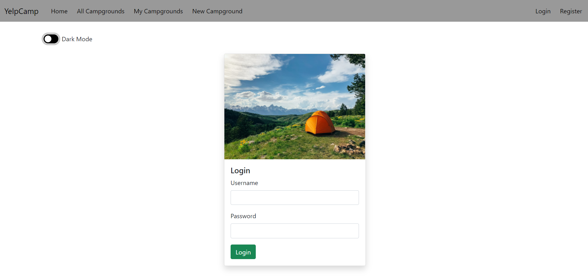

#### Login (dark mode)
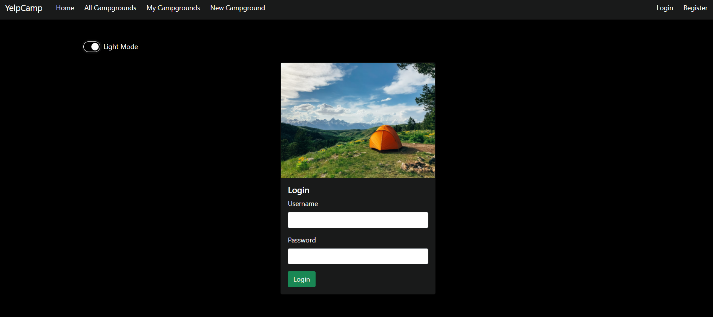

#### Register
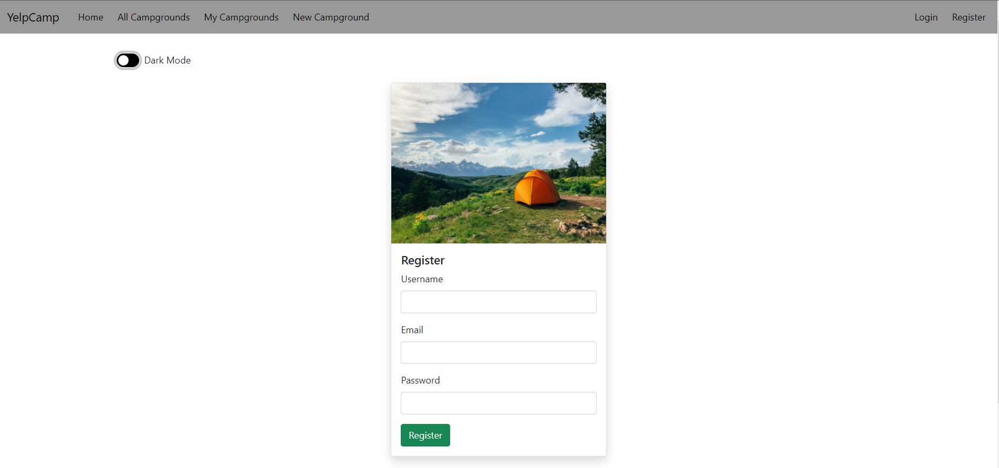

#### Register (dark mode)
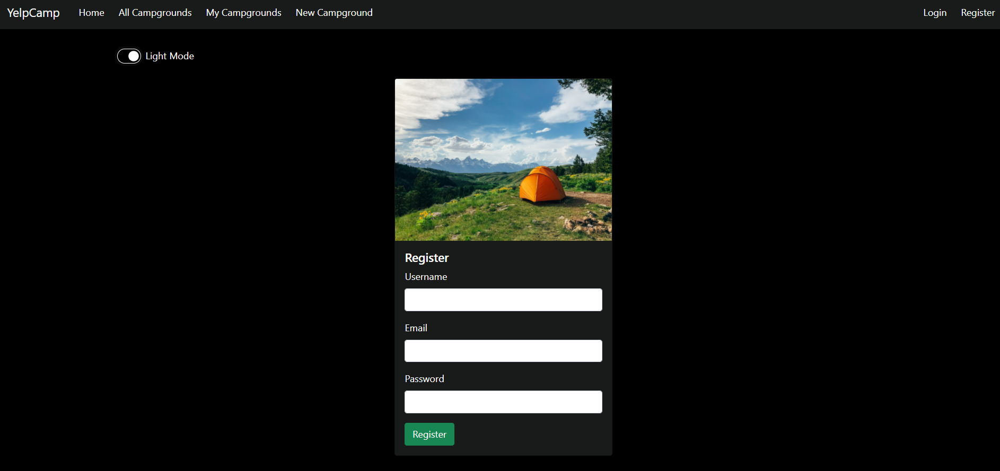

#### Homepage
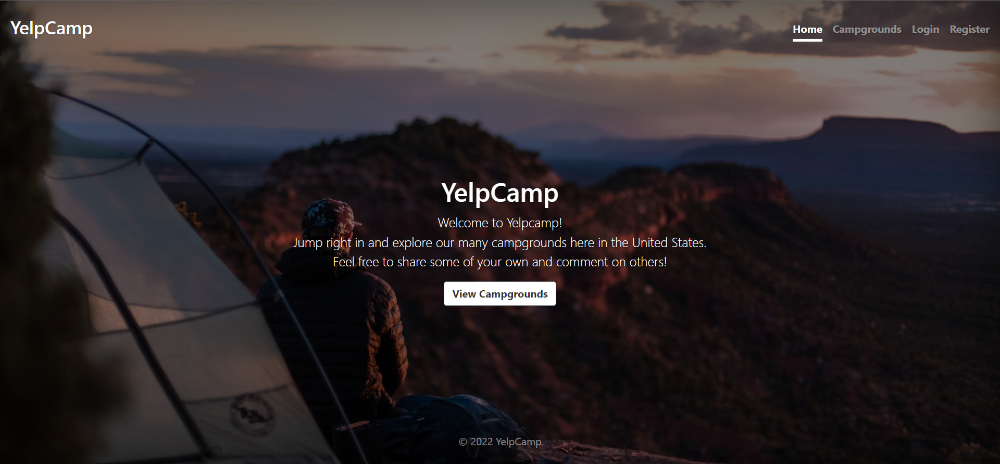

#### All Campgrounds
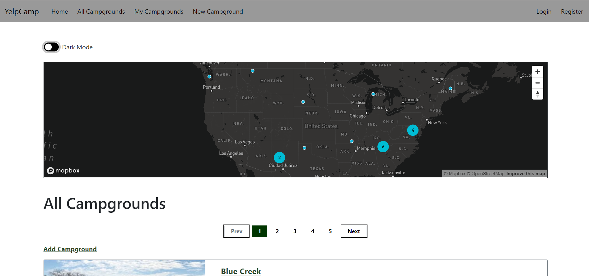

#### All Campgrounds
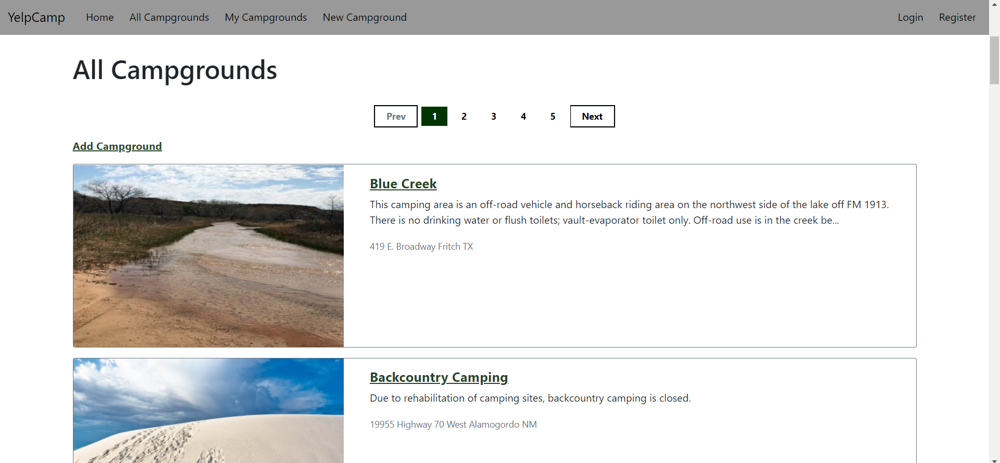

#### All Campgrounds (dark mode)
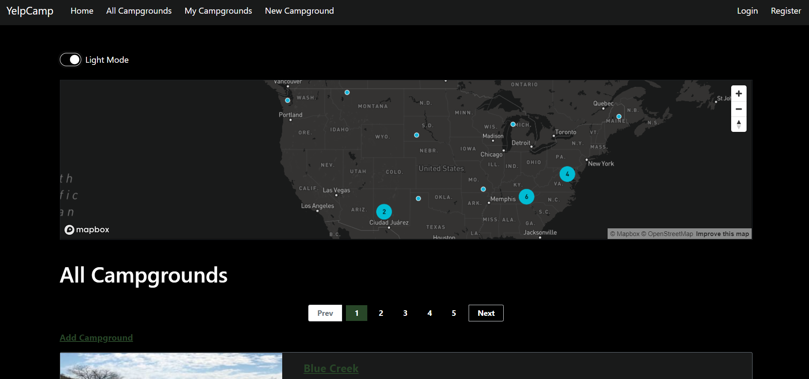

#### All Campgrounds (dark mode)


#### Show a Campground
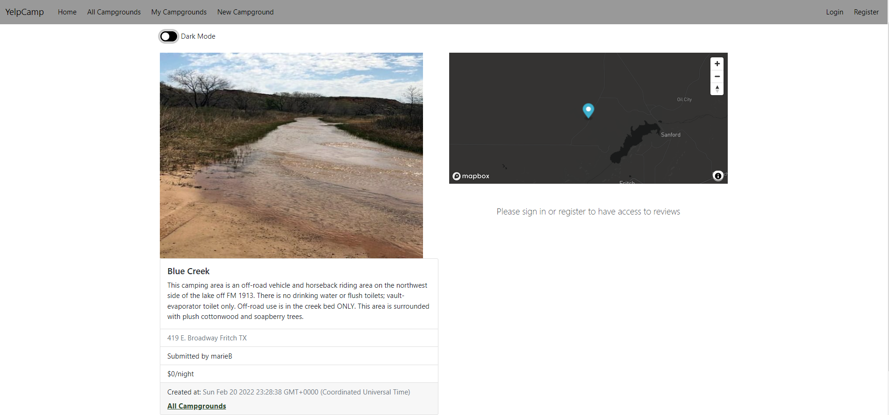

#### Show a Campground (dark mode)
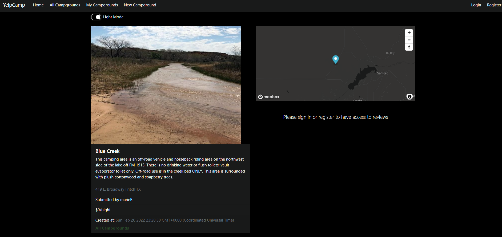

#### Edit a Campground
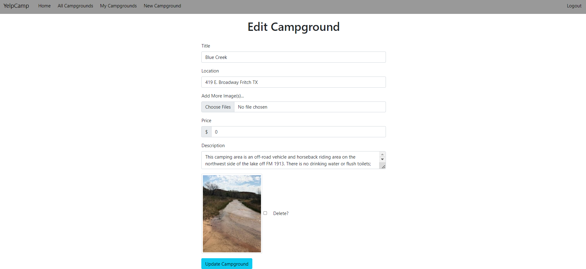

#### Reviews
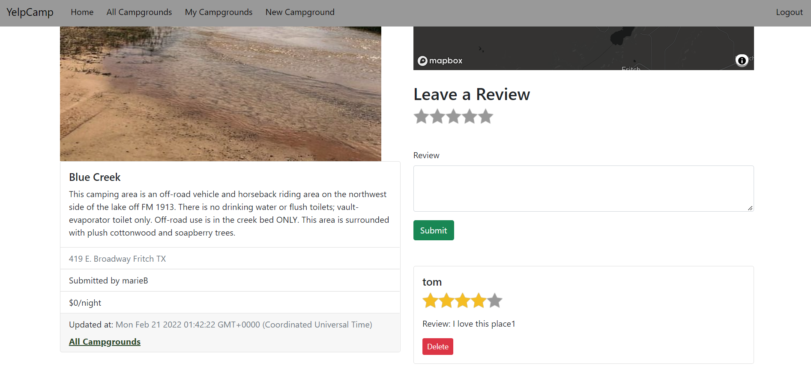


## 🧰Tools

### 
1.  #### Mongoose
2.  #### MapBox
3.  #### Coudinary
4.  #### Passport.js
5.  #### Embedded Javascript
6.  #### Axios
7.  #### Joi


## 💻 To run on your local machine:
### Prerequisties:
1. You should have the following installed on your machine:
- Node
- Mongo
- Git
- VS Code
2. You should have the following accounts to gain access to keys, and tokens required for the project:
- Cloudinary
- Mapbox
- NPS
  
### Steps:
1. On the main repository, click the green Code button and copy the SSH. 

2. Go or create a directory where you want the repository to be included then type this script on your terminal:
```
git clone [SSH HERE]
```
3. Open the cloned repository on VS Code.
4. On your terminal, download all the dependencies by typing
   `npm i` or `npm install`
5. Create a .env file to store the required keys for the project

    *replace value with the appropriate keys from the required accounts mentioned in the prerequisites*
 ```
CLOUDINARY_CLOUD_NAME=[value]
CLOUDINARY_KEY=[value]
CLOUDINARY_SECRET=[value]
MAPBOX_TOKEN=[value]
API_KEY=[value]
OWNER_ID=[value]
```

6. Open a new terminal and type `mongod` to connect the projects on your local database. The project will not start until this is not opened ⚠️
7. Now to seeds your database, on the previous terminal, type 
 ```
 node seeds/index.js
``` 
8. _(After getting a response of done on your terminal, wait for 3-8 seconds to let all the campgrounds' images get uploaded to cloudinary)._
9. Hit **CTRL+C** to exit the current process.
10. Now, you are ready to run the program by typing either of the script on your terminal:
```
node app.js
```
  or _(recommended)_
```
nodemon app.js
``` 
<br>
11. Once you see "Database connected", go to your preferred browser, then go to *localhost:3000*
